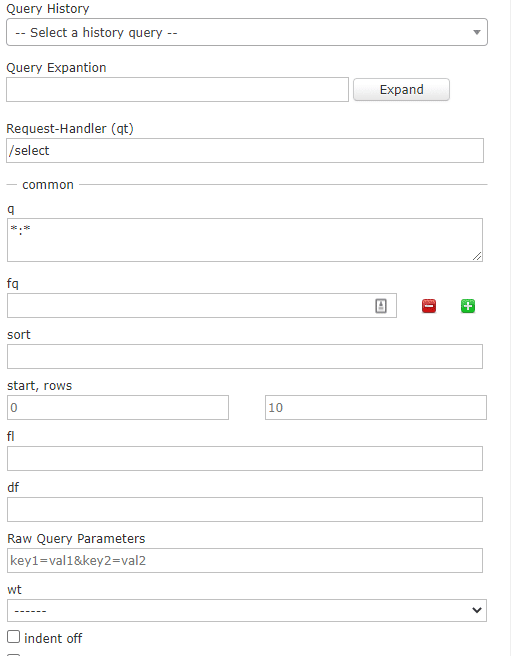
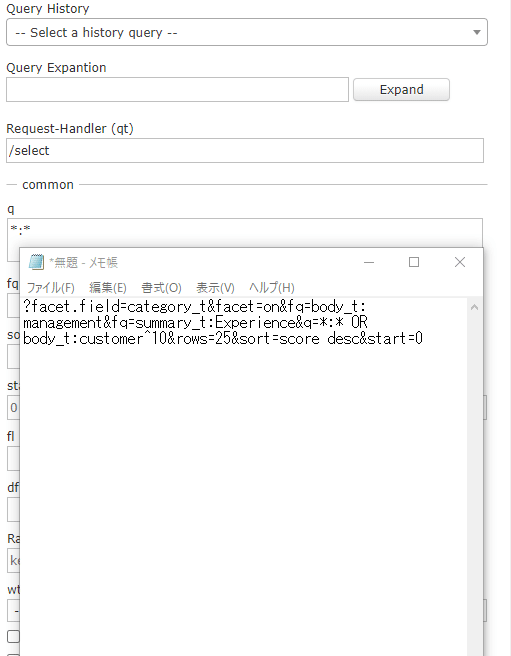

# Solr Admin Extension
*Solr Admin Extension* is a Chrome extension to extend the Solr admin page.  

## Features (TODOs):  
- [x] Query History
- [x] Query Expantion
- [ ] UI Improvement
- [ ] Aliases Viewer

### Query History

### Query Expantion

## Installation
This extension is not yet available in the Chrome Web Store. Clone this repository and load it as an unpackaged extension.

## License
*Solr Admin Extension* is licensed under the MIT license. See LICENSE.txt.

## Author
- Takumi Yamada (xirtardauq@gmail.com)